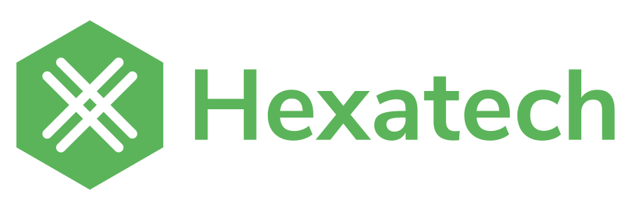

<h1 class="section-title"> {{ title }}</h1>

The services provided by Altertek are made possible with the help of different contributors, organisations and partners.
We also offer help to associations with values common to ours.
On this page, our definition of "sponsorship" includes any material, financial, or service offered.

## We are member of
- [the CHATONS collective](https://www.chatons.org/)
- [April](https://www.april.org/)

## We support
- [World Cleanup day France](https://www.worldcleanupday.fr): We ensure the IT management
- [Zero Waste France](https://www.zerowastefrance.org): Support for the democratization of Nextcloud in the association
- [Alternatiba](https://alternatiba.eu): Help on the infrastructure during climate camps

## We are supported by

Primary contributor
  
- [Updown](https://updown.io): They offer us their [monitoring solution](https://updown.io/#pricing)
- [Tailscale](https://tailscale.com): We have access to the Open source plan for server-to-server connectivity and secure remote access
- [GitHub](https://github.com): We use a [GitHub nonprofit account](https://github.com/nonprofit) for our GitHub organization account
- [GitLab](https://gitlab.com): We are beneficiaries from the [GitLab for Open Source Program](https://about.gitlab.com/solutions/open-source/)
