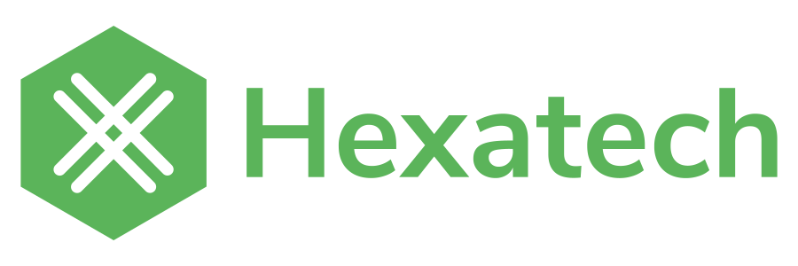

<h1 class="section-title"> {{ title }}</h1>

Les services fournis par Altertek sont rendus possibles avec l'aide de différents contributeurs, organisations et partenaires.
Nous proposons également de l'aide aux associations ayant des valeurs communes aux nôtres.
Dans cette page, notre définition de "soutien" comprend toute aide financière, matérielle ou service offert.

## Nous sommes membre de
- [Le collectif CHATONS](https://www.chatons.org/)
- [L'April](https://www.april.org/)

## Nous soutenons
- [World Cleanup day France](https://www.worldcleanupday.fr): Nous y assurons la gestion des services numériques
- [Zero Waste France](https://www.zerowastefrance.org): Aide à la démocratisation de Nextcloud dans l'association
- [Alternatiba](https://alternatiba.eu): Aide sur l'infrastructure pendant les camps climat

## Nous sommes soutenus par

Principal Contributeur  
  
- [Updown](https://updown.io): Mise à disposition gratuite de [l'offre de monitoring](https://updown.io/#pricing)
- [Tailscale](https://tailscale.com): Nous avons à disposition un compte "Open source" pour la connectivité entre serveurs et pour l'accès sécurisé à distance
- [GitHub](https://github.com): Nous utilisons un [compte à but non lucratif GitHub](https://github.com/nonprofit) pour notre compte d'organisation GitHub
- [GitLab](https://gitlab.com): Nous bénéfitions du programme [GitLab for Open Source](https://about.gitlab.com/solutions/open-source/)